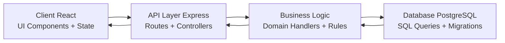

# Trello-style Kanban

A Trello-inspired kanban app with a personal Inbox, board lists, card covers, due dates, labels, archive/restore flows, and drag-and-drop card movement.

## Highlights

- Trello-like board lists with drag-and-drop list/card reordering
- Personal Inbox lane with convert-to-board and move-back flows
- Rich card metadata: labels, due dates, completion state, and covers
- Archived board cards with restore and permanent delete actions
- Local demo-data fallback when API/PostgreSQL are unavailable

## Tech Stack

- Frontend: React 19, Vite, plain CSS, dnd-kit
- Backend: Node.js, Express 5
- Database: PostgreSQL with SQL migrations
- Package management: npm workspaces

## System Flow Model

The application follows a layered request/response path from UI interactions down to PostgreSQL persistence.

```text
Client (React) -> API Layer (Express) -> Business Logic (Route/Domain Handlers) -> Database (PostgreSQL)
    ^                    ^                          ^                                ^
  UI Components      Controllers + Routes       State/Rules/Transforms         SQL + Pool + Migrations
  State Management   Request Validation         Workflow Coordination           Table Schemas + Rows
```



## Request Lifecycle (Typical)

1. User action triggers a handler in the React client.
2. The client updates optimistic local state for responsiveness.
3. The client sends an API request through the shared API utility.
4. Express routes validate input and execute domain-specific logic.
5. PostgreSQL queries persist changes and return normalized data.
6. The client hydrates/merges server data into board and inbox state.
7. If the API fails, UI state is rolled back or a fallback status is shown.

## Project Structure

```text
client/
  src/
    App.jsx                    # application orchestration and feature wiring
    components/                # reusable and feature-oriented React components
      inbox/                   # Inbox-specific components
      navigation/              # top bar, create board menu, bottom dock
      shared/                  # icons, avatars, inline title, shared card visuals
    config/boardConfig.js      # demo data, palettes, defaults
    utils/                     # API, date, board state, and view helpers
server/
  migrations/                  # idempotent PostgreSQL schema migrations
  src/
    app.js                     # Express app composition
    db/                        # pool, migration runner, seed script
    routes/                    # board, inbox, and health API routes
docs/                          # schema and deployment notes
```

## Runtime Architecture Notes

- The frontend orchestration lives in App.jsx and wires feature handlers.
- Reusable UI is split by domain under components/ (board, inbox, modals, shared).
- Pure state transformations are centralized in client/src/utils/boardState.js.
- API transport is centralized in client/src/utils/api.js.
- Backend routes are split into board/inbox/health modules in server/src/routes/.
- Database changes are tracked as ordered SQL migrations in server/migrations/.

## Setup

1. Install dependencies:

```bash
npm install
```

2. Create local environment settings:

```bash
cp .env.example .env
```

3. Start PostgreSQL and create a database named `trello_kanban`, or update `DATABASE_URL` in `.env`.

4. Run migrations and optional seed data:

```bash
npm run db:init
npm run db:seed
```

5. Start the API server:

```bash
npm run dev:server
```

6. Start the Vite client in another terminal:

```bash
npm run dev:client
```

The client runs on `http://localhost:5173` and proxies API calls to the server. The API defaults to `http://localhost:4000`.

## Environment

Configure these values in .env for local development:

- DATABASE_URL: PostgreSQL connection string
- PORT: backend server port (default 4000)
- CLIENT_ORIGIN: allowed frontend origin for API access

## Useful Commands

```bash
npm run build       # build the client
npm run start       # start the production API server
npm run db:init     # apply all SQL migrations
npm run db:seed     # reset and insert demo data
```

## Development Workflow

1. Run db:init after pulling migration changes.
2. Use db:seed when you need a clean baseline dataset.
3. Start dev:server and dev:client in parallel during feature work.
4. Run build before opening a PR to confirm production bundling.

## Assumptions

- The app is single-user oriented; there is no authentication layer yet.
- Migrations are idempotent and can be rerun locally.
- Demo data is used as a fallback when the API is unavailable.
- Card completion and due-date completion are separate states.
- Covers are stored as JSON metadata containing either image URL data or a color value.
- The current frontend keeps feature logic in `App.jsx`, while reusable UI, configuration, and pure state helpers are split into modules for readability.

## Troubleshooting

- API not reachable:
  - Confirm PostgreSQL is running and DATABASE_URL is correct.
  - Start the backend with npm run dev:server.
- Empty or stale UI data:
  - Re-run npm run db:init, then npm run db:seed.
  - Refresh the client after server startup.
- Build failures:
  - Reinstall dependencies with npm install at workspace root.
  - Run npm run build to surface the exact failing package.
<!--
File summary:
- Project overview and onboarding guide.
- Documents setup commands, stack choices, folder layout, and assumptions.
- Use this first when installing, running, or understanding the application.
-->
